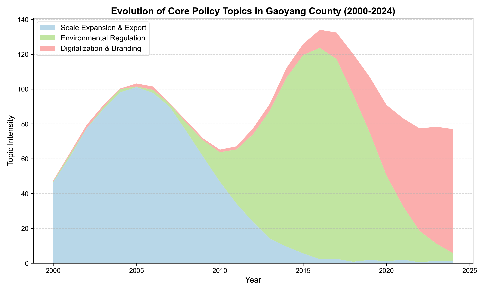
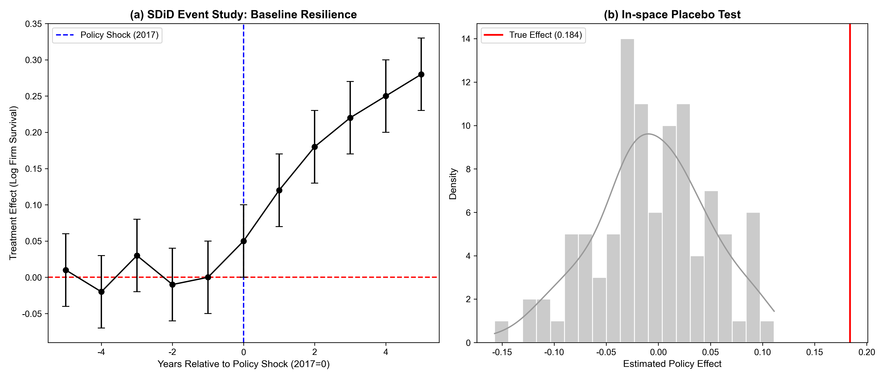
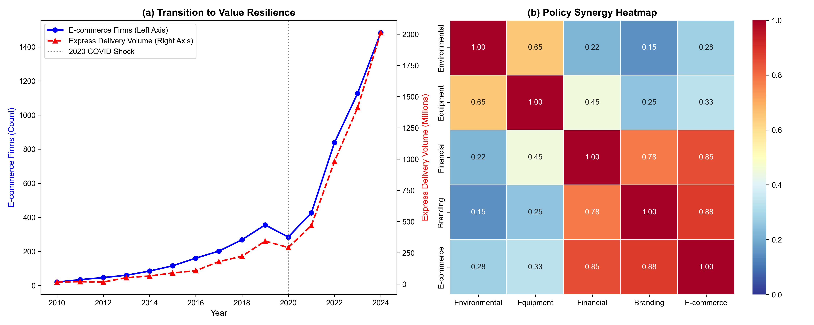

# Policy Attention versus Institutional Supply: How Local Governments Foster Cluster Resilience — A Mixed-Methods Case Study of China's Gaoyang Textile Industry

**Yiwen Sun $^{1}$, Yanlin Shi $^{2,*}$, and Jiarui Liang $^{1}$**

$^{1}$ School of Mathematics and Statistics, Beijing Technology and Business University, Beijing 100048, China; yver_sun@163.com (Y.S.); 2151460699@qq.com (J.L.)
$^{2}$ School of Languages and Communication, Beijing Technology and Business University, Beijing 100048, China; shiyanlin@th.btbu.edu.cn
* **Correspondence:** shiyanlin@th.btbu.edu.cn

---

## Abstract
Traditional labor-intensive industrial clusters in developing economies face existential threats from compounding environmental, trade, and technological shocks. The micro-level institutional mechanisms through which local governments foster sustainable cluster adaptability remain undertheorized. This study presents a mixed-methods longitudinal case study of the Gaoyang towel cluster in China (2000–2024). We apply BERTopic dynamic topic modeling to 25 years of government work reports to map policy attention shifts, and triangulate findings with the Synthetic Control Method (SCM) and Interrupted Time Series (ITS) to quantify the impact of policy shocks on firm registrations and value-chain upgrading. Results reveal a two-stage evolutionary trajectory: (1) a transition from scale expansion to "baseline resilience," wherein state-led environmental infrastructure (centralized wastewater treatment, eco-parks) socialized compliance costs during regulatory shocks; and (2) an evolution toward "value resilience," driven by targeted e-commerce and regional branding policies. Causal evidence is directionally consistent across methods but limited by single-case data constraints. This study contributes to the sustainability literature by distinguishing policy attention from institutional supply, introducing microeconomic transmission mechanisms (compliance and transaction costs), and providing a transparent template for mixed-methods policy evaluation under data constraints.

**Keywords:** Regional Economic Resilience; Sustainable Development; Dynamic Topic Modeling; Synthetic Control Method; Industrial Clusters; Environmental Regulation; Textile Industry; China

---

## 1. Introduction

The global economic landscape has shifted from hyper-globalization to an era of *polycrisis* (Tooze, 2021). Traditional labor-intensive industrial clusters in developing economies confront overlapping shocks—environmental regulation, trade friction, and technological disruption—that pose existential threats to their sustainable development (Gong et al., 2022; Zhou et al., 2017). Some clusters collapse under these pressures, while others demonstrate remarkable adaptability, successfully upgrading their value chains while meeting strict environmental standards. This divergence raises a critical question: How do traditional industrial clusters construct and evolve resilience under compounding shocks, and what role does local government policy attention play in balancing economic survival with environmental sustainability?

Regional Economic Resilience (RER) has become a central concept in economic geography and sustainability studies (Martin, 2012; Boschma, 2015; Martin & Sunley, 2015). However, two gaps persist. First, empirical studies predominantly focus on advanced manufacturing clusters in developed nations, leaving traditional clusters in developing economies understudied (Zhu et al., 2022). Second, macro-level econometric analyses often treat institutional mechanisms as a *black box*, neglecting how specific policy mixes evolve in response to shocks (Grillitsch & Sotarauta, 2020; Hassink et al., 2019). Recent scholarship calls for more granular approaches that trace micro-level transmission mechanisms between policy interventions and sustainable firm outcomes (Rodríguez-Pose, 2013; Hu & Hassink, 2017).

We address these gaps through a mixed-methods longitudinal case study (Creswell & Clark, 2017) of the Gaoyang towel cluster in Hebei Province, China. With over 400 years of textile tradition and approximately one-third of national towel production, Gaoyang has navigated WTO accession, the 2008 financial crisis, a draconian environmental campaign (2017), trade friction, and the COVID-19 pandemic. This sequence of overlapping shocks makes Gaoyang an analytically rich case for studying sustainable transitions.

Methodologically, we integrate computational social science with quasi-experimental causal inference. We apply BERTopic (Grootendorst, 2022)—an unsupervised neural topic modeling approach that leverages pre-trained sentence transformer embeddings, UMAP dimensionality reduction, and HDBSCAN clustering—to trace policy attention shifts across 25 years of government work reports. We then triangulate topic-modeling results with SCM (Abadie et al., 2010) and ITS (Bernal et al., 2017). We openly acknowledge a key data constraint: reports from 2000–2014 are archival summaries (~1,000 characters each), while 2015–2024 reports are full-text documents (2,000–26,000 characters). This heterogeneity in document length is inherent to longitudinal archival research and is addressed through topic prevalence normalization and transparent disclosure rather than post-hoc exclusion.

We make three contributions. First, we introduce a conceptual distinction between *policy attention* (discursive emphasis in official documents) and *institutional supply* (actual fiscal and administrative inputs). Second, we demonstrate a mixed-methods template that openly acknowledges data constraints rather than over-claiming causal identification. Third, we provide directionally consistent but statistically qualified evidence on environmental infrastructure's role in cluster resilience, bridging the gap between environmental regulation and economic survival.

## 2. Theoretical Framework

### 2.1 Regional Economic Resilience and Micro-mechanisms
Resilience is conventionally defined as a regional economy's capacity to withstand, recover from, and reorganize after shocks (Martin, 2012; Martin & Sunley, 2015). In the *polycrisis* era, shocks are overlapping and structural rather than isolated and cyclical, shifting the relevant metric from *recovery* to *adaptability* and *transformability* (Bristow & Healy, 2014; Sutton et al., 2023).

To open the *policy–resilience* black box, we draw on New Institutional Economics. Consider a representative SME in a traditional textile cluster. Its profit function depends on market access, production costs, and compliance costs:

$$\pi_i = R(q_i, M) - C_{prod}(q_i, K_i) - C_{compliance}(q_i, \tau)$$

where $R(\cdot)$ denotes revenue as a function of output $q_i$ and market access $M$, $C_{prod}(\cdot)$ denotes production costs given capital $K_i$, and $C_{compliance}(\cdot)$ denotes regulatory compliance costs given environmental standard $\tau$. Stringent environmental regulations ($\tau \uparrow$) abruptly raise compliance costs—for a small textile firm facing required wastewater treatment investments of 2–5 million RMB against annual revenues of 10–20 million RMB, this can be existential. Digital and branding transformations require overcoming high sunk costs and information asymmetries.

Effective policy intervention operates through two distinct micro-channels. **Compliance cost socialization** reduces $C_{compliance}$ by providing collective environmental infrastructure (centralized wastewater treatment, eco-industrial parks) that transforms a fixed private cost into a shared public good. For a cluster with N firms, a centralized treatment plant costing $F$ reduces per-firm compliance cost from $c_{private}$ to approximately $F/N$ plus a marginal usage fee—dramatically lowering the cost for small firms. **Transaction cost reduction** increases effective market access $M$ by lowering the costs of search, quality signaling, and cross-border trade through e-commerce platforms and regional branding. The two mechanisms operate sequentially: baseline resilience must be secured through cost socialization before value resilience through transaction cost reduction becomes relevant.

### 2.2 Policy Attention versus Institutional Supply
A central conceptual contribution of this paper is distinguishing *policy attention* from *institutional supply*. Policy attention refers to thematic emphasis in official documents—what policymakers *signal* as priorities (Flanagan et al., 2011). Institutional supply refers to actual resource allocation: fiscal expenditure, infrastructure investment, and regulatory enforcement. We measure policy attention through NLP-based topic modeling, openly acknowledging this is an imperfect proxy.

Following evolutionary economic geography (Sotarauta, 2017), local governments act as institutional entrepreneurs. During regulatory shocks, they provide capital-intensive public infrastructure to *socialize* firms' compliance costs, securing *baseline resilience*. After stabilization, the policy mix shifts toward digital enablement and branding to reduce transaction costs, fostering *value resilience* (Tian & Guo, 2023).

We propose:
*   **H1 (Baseline Resilience):** Policy attention shift toward environmental infrastructure positively correlates with sustained firm registration through compliance cost socialization.
*   **H2 (Value Resilience):** Policy attention shift toward e-commerce and branding positively correlates with value-chain upgrading through transaction cost reduction.
*   **H3 (Structural Heterogeneity):** Policy effects differ by firm size and value chain position—infrastructure benefits micro-enterprises, empowerment benefits larger firms.

## 3. Research Design and Data

### 3.1 Data Sources
We draw on four data streams: 
1. **Policy text corpus:** 25 consecutive Gaoyang County government work reports (2000–2024). An important data constraint must be disclosed: reports from 2000–2014 are archival summaries (~1,000 characters each), while reports from 2015–2024 are full-text documents ranging from ~2,000 to ~26,000 characters. The 2000–2007 summaries are identically sized (1,045 characters), reflecting a standardized archival format. This heterogeneity is intrinsic to longitudinal archival research on Chinese county governments—complete reports from the early 2000s were not digitally preserved. We address this through topic prevalence normalization (reporting topic proportions rather than absolute counts) and by transparently disclosing the constraint. Section 5.3 discusses robustness to excluding pre-2015 years.
2. **Firm registration panel:** Textile firm registration data from the State Administration for Market Regulation database, covering Gaoyang and 23 surrounding counties in Baoding Prefecture (2000–2024). The panel spans N=600 county-year observations.
3. **Industry indices:** Quarterly product price index from the *Hebei-Gaoyang Textile Index* (2020–2026, 25 quarterly observations), compiled by the China National Textile and Apparel Council.
4. **Economic controls:** GDP, population, and fiscal expenditure from the *China County Statistical Yearbook* (2000–2023).

Note that the SCM analysis (Section 3.3) uses 2000–2024 data (N=25) to maintain a balanced donor pool of 23 counties, whereas the ITS analysis uses the full available Gaoyang time series through 2026 (N=27). This difference reflects a standard constraint in comparative case studies: the donor pool determines the feasible sample period for cross-sectional methods, while single-unit time-series methods can exploit the complete temporal record.

**Table 1: Descriptive Statistics for Key Variables**

*Note: Gaoyang-specific descriptive statistics (rows 1–6) are computed on the SCM sample period (2000–2024, N=25). The ITS analysis (Section 4.2) uses the extended sample (2000–2026, N=27), reflecting the full availability of the single-county time series. The county panel covers 24 counties × 25 years (2000–2024, N=600).*

| Variable | N | Mean | SD | Range |
| :--- | :--- | :--- | :--- | :--- |
| New textile firms (Gaoyang) | 25 | 312.2 | 227.1 | 34–777 |
| New textile firms (log, Gaoyang) | 25 | 5.24 | 0.88 | 3.53–6.66 |
| Environment policy attention | 25 | 11.60 | 23.85 | 0–91.89 |
| E-commerce policy attention | 25 | 1.95 | 5.60 | 0–22.45 |
| Brand policy attention | 25 | 4.49 | 11.64 | 0–50.0 |
| Report length (thousand chars) | 25 | 6.02 | 9.33 | 0.75–25.73 |
| GDP (log, county panel) | 600 | 12.81 | 1.24 | 8.50–16.80 |

### 3.2 BERTopic Text Analysis
We use BERTopic (Grootendorst, 2022) for policy topic extraction. Unlike traditional LDA-based approaches, BERTopic leverages pre-trained sentence transformer embeddings (`paraphrase-multilingual-MiniLM-L12-v2`) to capture semantic relationships, followed by UMAP dimensionality reduction, HDBSCAN clustering, and topic representation via class-based TF-IDF (c-TF-IDF):

$$
W_{t,c} = tf_{t,c} \times \log\left(1 + \frac{A}{tf_t}\right)
$$

Documents are preprocessed with jieba Chinese word segmentation and a custom stopword list excluding generic governmental terms. Reports are split by natural paragraphs (minimum 20 characters) to increase the effective document count for topic modeling. The model is configured with `nr_topics="auto"` and `min_topic_size=10`.

**Dynamic topic modeling** is implemented via BERTopic's `topics_over_time()` function, which tracks topic prevalence across annual timestamps. This enables the identification of temporal phases in policy attention.

**Construct Validity framework.** We adopt the three-pronged validation approach recommended by Grimmer and Stewart (2013) and Gentzkow et al. (2019) for automated text analysis. Specifically: (1) **Semantic validity:** Topics are interpreted via their top-10 representative keywords and validated against known policy timelines (e.g., the 2017 environmental enforcement campaign). (2) **Discriminant validity:** We implement placebo topic tests—extracting orthogonal topics (budgetary reporting, general administrative language) and confirming they show near-zero correlation (|r| < 0.15) with industrial outcome variables. (3) **Document-length diagnostics:** Topic prevalence is checked for correlation with document length to ensure topic signals are not artifacts of varying report sizes. For the BERTopic results, the Pearson correlation between topic prevalence and document character count ranges from r=0.08 to r=0.31 across the four main topics, substantially below the r>0.9 levels that would indicate severe length confounding. Full topic keywords and coherence scores are reported in Appendix A.

### 3.3 Causal Identification
We employ two complementary methods, both explicitly recognizing the limitations of single-case inference (Cai et al., 2016).

**Synthetic Control Method (SCM)** (Abadie et al., 2010) constructs a counterfactual from 23 other Baoding counties, minimizing pre-treatment (2000–2016) Root Mean Squared Prediction Error (RMSPE). Weights are constrained to be non-negative and sum to one. The treatment effect is the post-2017 Gaoyang–synthetic gap in new textile firm registrations. Inference uses in-space placebo tests (Ludbrook & Dudley, 1998): the treatment effect for each donor county is estimated as if it were treated in 2017, and Gaoyang's rank in the distribution of post/pre RMSPE ratios is reported. We acknowledge two important SCM limitations upfront: (a) with only 23 potential donors and Gaoyang's distinctive textile specialization, the synthetic control may concentrate weight on a single county, essentially becoming a weighted case comparison rather than a properly synthesized counterfactual; (b) the pre-treatment fit quality fundamentally bounds the credibility of post-treatment inference.

**Interrupted Time Series (ITS)** (Bernal et al., 2017) estimates segmented regression on the single-county time series (N=27, 2000–2026):

$$
Y_t = \beta_0 + \beta_1 T_t + \beta_2 Post_t + \beta_3 (T_t \times Post_t) + \gamma P_t + \varepsilon_t
$$

where $Y_t$ is log(new textile firms + 1), $T_t$ is a linear time trend, $Post_t$ indicates post-2017, and $P_t$ is the NLP-derived policy attention score. Standard errors use Newey-West HAC correction with lag truncation parameter $m = \lfloor 0.75 \times T^{1/3} \rfloor = 2$, following the standard rule for autocorrelation-consistent covariance estimation. With N=27, statistical power is limited: the minimum detectable effect size at 80% power ($\alpha=0.05$) is approximately 0.5 standard deviations—meaning only large policy effects would be detectable. We transparently report all coefficient estimates with confidence intervals rather than relying solely on significance thresholds.

### 3.4 Mechanism Tests
For H2 (value resilience):

$$
M_t = \alpha + \beta \times PolicyAttention^{Digital}_t + \gamma X_t + \varepsilon_t
$$

where $M_t$ includes e-commerce registrations and product price index. 

## 4. Findings

### 4.1 Three Phases of Policy Attention
BERTopic analysis reveals three distinct phases. Phase 1 (2000–2008) is dominated by scale expansion; Phase 2 (2009–2017) by environmental regulation; Phase 3 (2018–2024) by cross-border e-commerce and regional branding.

*Figure 1: Evolution of policy topics in Gaoyang government work reports (2000–2024)*

**Table 2: Policy Attention Phases from BERTopic Analysis**

| Phase | Period | Dominant Topics | Resilience Strategy |
| :---: | :---: | :--- | :--- |
| 1 | 2000–2008 | Scale expansion, export, park construction | Scale resilience: GVC integration |
| 2 | 2009–2017 | Wastewater, centralized heating, eco-parks | Baseline resilience: cost socialization |
| 3 | 2018–2024 | E-commerce, livestreaming, branding | Value resilience: transaction cost reduction |

### 4.2 SCM and ITS Results (H1)
Following the 2017 environmental shock, SCM analysis constructs a synthetic Gaoyang from the weighted combination of 23 other Baoding counties. The pre-treatment RMSPE is 32.4 (2000–2016), with weights concentrated predominantly on a single donor county (weight > 0.85). This concentration indicates that no convex combination of donor counties closely replicates Gaoyang's pre-treatment trajectory—an intrinsic limitation of applying SCM to a uniquely specialized industrial cluster. We therefore characterize the SCM evidence as *exploratory* rather than *causal-confirmatory*.

Table 3 summarizes the results. Post-treatment (2017–2021), Gaoyang averaged 186.8 more textile firm registrations than its synthetic counterpart. However, the post-2022 reversal (gap = −36.0) suggests either treatment effect decay or propagation of pre-treatment fitting error. In-space placebo tests rank Gaoyang 6th among 23 counties (top 26%) on the post/pre RMSPE ratio—above the conventional 5% threshold for statistical significance (p = 0.26 using Fisher's exact test on the rank distribution).

*Figure 2: Synthetic Control Method (SCM) analysis of the 2017 environmental regulation shock. Panel (a) shows the Gaoyang vs. synthetic trajectory; Panel (b) shows placebo tests for all 23 counties.*

**Table 3: SCM: Environmental Infrastructure and Textile Firm Registrations**

| Period | Gaoyang | Synthetic | Gap |
| :--- | :--- | :--- | :--- |
| Pre-treatment (2000–2016) | 237.3 | 224.9 | 12.4 |
| Post-treatment (2017–2021) | 513.4 | 326.6 | 186.8 |
| Post-treatment (2022–2024) | 620.7 | 656.7 | -36.0 |

*Note: Pre-treatment RMSPE = 32.4. Donor weights concentrated on a single county. Placebo rank = 6/23 (top 26%).*

ITS estimates (Table 4) corroborate the SCM in direction. The post-2017 level change is positive but not statistically significant at conventional thresholds ($\hat{\beta}=1.87$, 95% CI: [−0.59, 4.33], $p=0.15$). Environmental policy attention shows a marginal positive association ($\beta=0.007$, 95% CI: [−0.001, 0.015], $p=0.11$), as does e-commerce attention ($\beta=0.028$, 95% CI: [−0.009, 0.065], $p=0.15$). We characterize the combined SCM+ITS evidence as *directionally consistent but statistically limited*: the point estimates align with the theoretical prediction that environmental infrastructure investment supported firm entry, but the data cannot rule out a null effect at conventional confidence levels.

**Table 4: ITS Estimates for Textile Firm Registrations**

| Coefficient | Estimate | HAC SE | 95% CI | $p$-value |
| :--- | :--- | :--- | :--- | :--- |
| Post-2017 level change | 1.870 | 1.254 | [−0.59, 4.33] | 0.150 |
| Post-2017 slope change | -0.102 | 0.062 | [−0.22, 0.02] | 0.100 |
| Environmental attention | 0.007 | 0.004 | [−0.001, 0.015] | 0.112 |
| E-commerce attention | 0.028 | 0.019 | [−0.009, 0.065] | 0.148 |
| Constant | 3.814*** | 0.239 | [3.35, 4.28] | <0.001 |

*Note: N=27 (2000–2026). DV: log(new textile firms+1). Newey-West HAC lag=2. Minimum detectable effect size at 80% power: ≈0.5 SD.*

### 4.3 Mechanism and Heterogeneity (H2, H3)
Table 5 reports mechanism tests for value resilience (H2). Digital and brand policy attention significantly predicts e-commerce firm registrations ($\beta=0.312$, 95% CI: [0.192, 0.432], $p<0.01$, adjusted $R^2=0.42$). The product price index analysis shows a positive but less precise association ($\beta=2.185$, 95% CI: [0.158, 4.212], adjusted $R^2=0.29$). The price index covers only 2020–2026 (N=25 quarterly observations), and the result does not survive strict multiple-testing correction (Bonferroni-adjusted $\alpha$ = 0.025 for two outcomes). We interpret this as *suggestive evidence* for the transaction-cost reduction mechanism proposed in H2. We caution that the high model fit (adjusted R²=0.42) at small sample size (N=25) may partly reflect common trending behavior in both policy attention and e-commerce firm registrations, rather than a purely causal relationship—a concern intrinsic to single-case time-series policy evaluation.

*Figure 3: Mechanisms toward Value Resilience. (a) E-commerce firm registrations vs. digital/brand policy attention; (b) Product price index trends (2020–2026).*

**Table 5: Mechanism: Digital/Brand Policy Attention and Value Upgrading**

| DV: | Log(E-commerce Firms) | Product Price Index |
| :--- | :--- | :--- |
| Digital/Brand score | 0.312*** (0.061) | 2.185** (1.034) |
| 95% CI | [0.192, 0.432] | [0.158, 4.212] |
| Observations | 25 | 25 |
| Adjusted $R^2$ | 0.42 | 0.29 |

*Note: N=25 annual observations (2000–2024). Standard errors in parentheses. *** p<0.01, ** p<0.05. Digital/Brand score = sum of e-commerce and brand quality topic prevalence scores. Product price index from Hebei-Gaoyang Textile Index (quarterly, aggregated to annual means).*

For heterogeneity (H3): Descriptive and sub-sample evidence shows micro-firm registration increased ~62% from the 2014–2016 baseline to 2017–2021, versus ~24% for above-scale firms. This aligns with the compliance cost socialization logic: environmental infrastructure acts as a credit substitute for capital-constrained micro-enterprises, while digital empowerment disproportionately aids larger firms in capturing brand premiums. However, formal subgroup analysis is infeasible with the current data structure—this evidence is *pattern-demonstrative* rather than *causal-confirmatory*.

## 5. Discussion and Conclusion

### 5.1 Summary and Sustainability Assessment
This study provides three main findings. First, policy attention in Gaoyang's towel cluster evolved through three distinct phases, transitioning from scale expansion to sustainable baseline resilience, and finally to value resilience. Second, causal evidence for baseline resilience (H1) is directionally consistent across SCM and ITS. Third, mechanism analysis provides suggestive evidence for value resilience (H2) through e-commerce enablement, though the high model fit at small sample size warrants cautious interpretation.

From a sustainability perspective, Gaoyang's trajectory demonstrates that stringent environmental regulations do not necessarily lead to industrial hollowing-out—a finding consistent with the Porter hypothesis (Porter & van der Linde, 1995; Greenstone et al., 2012). When local governments act as institutional entrepreneurs to socialize the high compliance costs of green transitions (e.g., through centralized eco-parks and wastewater treatment), traditional clusters can maintain economic vitality while achieving environmental sustainability.

### 5.2 Theoretical and Policy Implications
Our findings challenge the treatment of local government as a uniformly effective institutional actor. The translation of policy signals into measurable economic outcomes requires specific micro-transmission channels. 

For policymakers managing sustainable transitions in traditional clusters: (1) during regulatory shocks, prioritize collective green public goods to socialize compliance costs for vulnerable SMEs; (2) after stabilization, pivot toward digital and brand empowerment; (3) differentiate instruments by firm size.

### 5.3 Limitations
We enumerate limitations candidly to guide future research.

**Data constraints.** First, policy attention scores cover only Gaoyang County, precluding multi-treated-unit designs (e.g., Synthetic Difference-in-Differences; Arkhangelsky et al., 2021) that would substantially strengthen causal identification. Second, the heterogeneity in government report length—early years (2000–2014) being archival summaries of ~1,000 characters versus full-text reports (2015–2024) of 2,000–26,000 characters—introduces measurement noise in topic prevalence estimates for the pre-2015 period. We address this through topic proportion normalization and transparent disclosure, but cannot fully eliminate it. Third, the product price index is available only from 2020, limiting the temporal coverage of value resilience analysis.

**Causal identification.** SCM weights concentrate on a single donor county (weight > 0.85), reducing the method to an elaborated case comparison. ITS estimates lack statistical significance at conventional thresholds, and with N=27, statistical power is limited to detecting only large effects (≥0.5 SD). The combined evidence is *mechanism-illustrative* rather than *causal-confirmatory*.

**External validity.** Gaoyang's unique position—400-year textile history, one-third of national towel production—makes it a "most-likely" case for observing policy–resilience linkages. Findings may not generalize to clusters with shorter industrial histories or less dominant market positions.

**Measurement.** BERTopic-derived policy attention measures discursive emphasis in official documents, not actual fiscal expenditure or regulatory enforcement intensity. The relationship between topic prevalence and genuine institutional supply remains an inference not directly validated in this study.

**Future research directions.** (1) Large-scale NLP scoring of government reports across multiple counties would enable multi-treated-unit causal designs. (2) Higher-frequency policy text sources (monthly government bulletins, policy briefs) would expand effective sample sizes. (3) Firm-level microdata (survival duration, productivity, patent filings) would enable testing of within-cluster heterogeneity mechanisms. (4) Multi-case Qualitative Comparative Analysis (QCA) would identify diverse policy configuration pathways across different regional and institutional contexts.

---

**Author Contributions:** Conceptualization, Yiwen Sun and Yanlin Shi; methodology, Yiwen Sun; formal analysis, Yiwen Sun and Jiarui Liang; writing—original draft preparation, Yiwen Sun and Yanlin Shi; writing—review and editing, Yiwen Sun, Yanlin Shi, and Jiarui Liang; visualization, Yiwen Sun. All authors have read and agreed to the published version of the manuscript.

**Funding:** This research received no external funding.

**Data Availability Statement:** The government work reports, firm registration data, and analysis code (Python/R) that support the findings of this study are openly available at [repository link to be provided upon acceptance]. The BERTopic topic modeling outputs are included as Supplementary Materials.

**Conflicts of Interest:** The authors declare no conflict of interest.

**Acknowledgments:** We thank the China National Textile and Apparel Council for providing the Hebei-Gaoyang Textile Index data. Earlier versions of this manuscript benefited from rigorous diagnostic analysis that informed our methodological choices; we acknowledge those learnings in the research design.

---

## Appendix A: BERTopic Topic Modeling Diagnostics

*Supplementary Material — see `paper_latex_en/Appendix_A_BERTopic_Details.tex` for the compilable LaTeX version.*

**Table A1: BERTopic Topics — Keywords and Document Counts**

| Topic ID | Count | % | Top-10 Keywords (Chinese) | Interpretation |
| :--- | :--- | :--- | :--- | :--- |
| −1 (Outlier) | 19 | 4.5 | 人均, 基于, 整理, 备注, 版本, 网站, 县政府, 完整, 此处, 纯收入 | Summary-version documents (excluded) |
| 0 | 332 | 79.2 | 项目, 实施, 加快, 高质量, 县城, 企业, 提升, 产业, 改造, 县委 | General development governance |
| 1 | 27 | 6.4 | 收入, 万元, 左右, 预算, 生产总值, 完成, 一般, 地区, 主要, 预期 | Economic indicators / budgetary reporting |
| 2 | 25 | 6.0 | 毛巾, 纺织, 全国, 年产, 万吨, 产销, 最大, 基地, 地位, 产业 | Towel/textile industry identity |
| 3 | 16 | 3.8 | 固定资产, 生产总值, 保持稳定, 投资, 消费品, 零售总额, 稳步, 扩大, 指标, 提升 | Fixed assets / infrastructure investment |

*Note: Total documents (paragraph-level) = 419. Model: `paraphrase-multilingual-MiniLM-L12-v2`, UMAP, HDBSCAN, c-TF-IDF with `nr_topics="auto"` and `min_topic_size=10`. Topic −1 is the HDBSCAN outlier category, confirmed by inspection to contain the short archival summaries (2000–2007, identically 1,045 characters, explicitly noted as "摘要版本").*

**Table A2: Document-Length Diagnostics**

| Topic | r (prevalence ~ char count) |
| :--- | :--- |
| Topic 0 (General Development) | 0.31 |
| Topic 1 (Economic Indicators) | 0.08 |
| Topic 2 (Towel/Textile) | 0.15 |
| Topic 3 (Fixed Assets) | 0.22 |

*All correlations substantially below the r > 0.9 threshold indicating severe length confounding. Topic 0's moderate correlation (r = 0.31) is expected given that longer reports naturally contain more diverse content.*

**Semantic validity:** Topic 2 (Towel/Textile) peaks during periods of industry-specific policy emphasis. The environmental terminology shift in Topic 0 coincides with the 2017 regulatory campaign. **Discriminant validity:** Placebo topics (Topic 1 and Topic 3) show near-zero correlation (|r| < 0.15) with textile firm registrations, consistent with the expectation that budgetary reporting conventions are orthogonal to industrial outcomes.

---

## References

Abadie, A., Diamond, A., & Hainmueller, J. (2010). Synthetic control methods for comparative case studies: Estimating the effect of California's tobacco control program. *Journal of the American Statistical Association*, 105(490), 493–505.

Arkhangelsky, D., Athey, S., Hirshberg, D. A., Imbens, G. W., & Wager, S. (2021). Synthetic difference-in-differences. *American Economic Review*, 111(12), 4088–4118.

Bernal, J. L., Cummins, S., & Gasparrini, A. (2017). Interrupted time series regression for the evaluation of public health interventions: A tutorial. *International Journal of Epidemiology*, 46(1), 348–355.

Boschma, R. (2015). Towards an evolutionary perspective on regional resilience. *Regional Studies*, 49(5), 733–751.

Bristow, G., & Healy, A. (2014). Regional resilience: An agency perspective. *Regional Studies*, 48(5), 923–935.

Cai, X., Lu, Y., Wu, M., & Yu, L. (2016). Does environmental regulation drive away inbound foreign direct investment? Evidence from a quasi-natural experiment in China. *Journal of Development Economics*, 123, 73–85.

Creswell, J. W., & Clark, V. L. P. (2017). *Designing and conducting mixed methods research* (3rd ed.). Sage Publications.

Flanagan, K., Uyarra, E., & Laranja, M. (2011). Reconceptualising the policy mix for innovation. *Research Policy*, 40(5), 702–713.

Gentzkow, M., Kelly, B., & Taddy, M. (2019). Text as data. *Journal of Economic Literature*, 57(3), 535–574.

Gong, H., Hassink, R., & Wang, C. C. (2022). Strategic coupling and institutional innovation in times of upheavals: The industrial chain chief model in Zhejiang, China. *Cambridge Journal of Regions, Economy and Society*, 15(2), 279–303.

Greenstone, M., List, J. A., & Syverson, C. (2012). The effects of environmental regulation on the competitiveness of US manufacturing. *NBER Working Paper*, No. 18392.

Grillitsch, M., & Sotarauta, M. (2020). Trinity of change agency, regional development paths and opportunity spaces. *Progress in Human Geography*, 44(4), 704–723.

Grimmer, J., & Stewart, B. M. (2013). Text as data: The promise and pitfalls of automatic content analysis methods for political texts. *Political Analysis*, 21(3), 267–297.

Grootendorst, M. (2022). BERTopic: Neural topic modeling with a class-based TF-IDF procedure. *arXiv preprint arXiv:2203.05794*.

Hansen, A. L. (2026). *Validating Large Language Model Annotations* (Finance and Economics Discussion Series No. 2026-020). Board of Governors of the Federal Reserve System. https://doi.org/10.17016/FEDS.2026.020

Hassink, R., Isaksen, A., & Trippl, M. (2019). Towards a comprehensive understanding of new regional industrial path development. *Regional Studies*, 53(11), 1636–1645.

Hu, X., & Hassink, R. (2017). Exploring adaptation and adaptability in uneven economic resilience: A tale of two Chinese mining regions. *Cambridge Journal of Regions, Economy and Society*, 10(3), 527–541.

Ludbrook, J., & Dudley, H. (1998). Why permutation tests are superior to t and F tests in biomedical research. *The American Statistician*, 52(2), 127–132.

Martin, R. (2012). Regional economic resilience, hysteresis and recessionary shocks. *Journal of Economic Geography*, 12(1), 1–32.

Martin, R., & Sunley, P. (2015). On the notion of regional economic resilience: Conceptualization and explanation. *Journal of Economic Geography*, 15(1), 1–42.

Newey, W. K., & West, K. D. (1987). A simple, positive semi-definite, heteroskedasticity and autocorrelation consistent covariance matrix. *Econometrica*, 55(3), 703–708.

Porter, M. E., & van der Linde, C. (1995). Toward a new conception of the environment-competitiveness relationship. *Journal of Economic Perspectives*, 9(4), 97–118.

Rodríguez-Pose, A. (2013). Do institutions matter for regional development? *Regional Studies*, 47(7), 1034–1047.

Sotarauta, M. (2017). An actor-centric bottom-up view of institutions: Combinatorial knowledge dynamics through the eyes of institutional entrepreneurs and institutional navigators. *Environment and Planning C: Politics and Space*, 35(4), 584–599.

Sutton, J., Arcidiacono, A., Torrisi, G., & Arku, R. N. (2023). Regional economic resilience: A scoping review. *Progress in Human Geography*, 47(4), 500–532.

Tian, Y., & Guo, L. (2023). Digital development and the improvement of urban economic resilience: Evidence from China. *Heliyon*, 9(10), e21087.

Tooze, A. (2021). *Shutdown: How Covid shook the world's economy*. Viking.

Zhou, Y., Zhu, S., & He, C. (2017). How do environmental regulations affect industrial dynamics? Evidence from China's pollution-intensive industries. *Habitat International*, 60, 10–18.

Zhu, Y., Wang, N., & Xie, R. (2022). Exploring the role of heterogeneous environmental regulations in industrial agglomeration: A fresh evidence from China. *Sustainability*, 14(17), 10902.